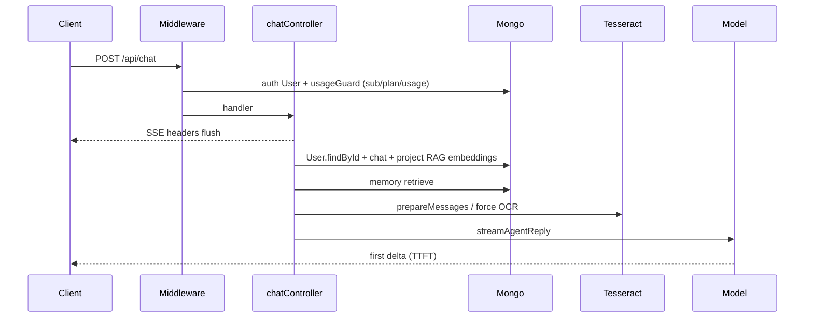

# VANI AI — Performance Audit Report

**Date:** 2026-08-06  
**Role:** Lead Performance Engineer  
**Phase / Task:** RC1-P1 — Performance Audit (read-only; no code changes)  
**Product posture:** VANI AI v1 consumer RC1 — Public Beta readiness  
**Companions:** [PERFORMANCE_REPORT.md](../../PERFORMANCE_REPORT.md) (Sprint 1 frontend), [ARCHITECTURE.md](../../ARCHITECTURE.md), [LAUNCH_CHECKLIST.md](../../LAUNCH_CHECKLIST.md)

---

## Executive summary

VANI’s Sprint 1 frontend work (lazy feature panels, voice isolation, message virtualization) is still in place, but **first-load JS has regressed** and several **chat TTFT** bottlenecks remain on the backend hot path. Infrastructure scaffolding (Docker multi-stage, `/health`/`/ready`, graceful shutdown) is solid for a **single-instance** launch; horizontal scale and delivery (compression/CDN) are not yet production-hardened.

| | |
|--|--|
| **Overall Performance Score** | **5.8 / 10** |
| **Launch Risk** | **Medium–High** for Public Beta without the Top 10 fixes |
| **Critical findings** | 8 |
| **Major findings** | 22 |
| **Minor findings** | 16 |
| **Recommendation** | Fix bundle regression + chat TTFT + Redis/compression gates **before** Public Beta; treat vector search / message storage as near-term follow-ons |

### Score breakdown

| Area | Score | Notes |
|------|------:|-------|
| Frontend delivery | 4.5 / 10 | `/` first-load **2.28 MB** (was 1.77 MB after Sprint 1) |
| Frontend runtime | 6.5 / 10 | Lazy panels + voice isolation help; streaming + shell coupling hurt |
| Backend latency | 5.0 / 10 | TTFT blocked by serial Mongo/OCR/RAG before first token |
| Data / cache | 5.5 / 10 | Good list indexes; no vector index; Redis underused |
| Heavy features | 6.0 / 10 | Browser pool / MCP reconnect OK; OCR serial; research search sequential |
| Infrastructure | 6.5 / 10 | Graceful shutdown + probes good; no HTTP compression; heavy default image |

---

## Method

1. Read project context, architecture, sprint board, known issues, and prior `PERFORMANCE_REPORT.md`.
2. Measure frontend from `.next/diagnostics/route-bundle-stats.json` (build present 2026-08-06) vs `frontend/scripts/bundle-*.json` (2026-08-03).
3. Inspect frontend lazy registry, import graphs (`jspdf` / canvas barrel / KaTeX), streaming/render paths.
4. Inspect backend chat path, middleware, Mongo indexes, RAG/OCR/research/agents/browser/MCP/code-interpreter.
5. Inspect Docker, compose, CI, compression, Redis optionality, launch checklist.

**Out of scope:** code changes, optimizations, load tests against live providers, redesign.

---

## Measured baselines

### Frontend bundle (uncompressed first-load JS)

| Route / snapshot | Bytes | MB |
|------------------|-----:|---:|
| Sprint 1 baseline (`bundle-baseline.json`, 2026-08-03) | 2,106,186 | **2.009** |
| Sprint 1 after (`bundle-after.json`, 2026-08-03) | 1,860,694 | **1.774** |
| **RC1 current** (`route-bundle-stats.json`, `/`) | 2,394,899 | **2.284** |
| RC1 `/share/[shareId]` | 1,271,657 | **1.213** |

**RC1 vs Sprint 1 after:** **+534 KB (+28.7%)**. Also **worse than the pre-optimization baseline** by +289 KB (+13.7%).

Top `/` first-load chunks (on-disk, current build): **424 / 416 / 344 / 261 / 227 KB**. Fingerprints and import graph point to **jspdf / PDF helpers**, **KaTeX + markdown**, and **docx/JSZip** on the critical path.

### Prior Sprint 1 wins still present

- `frontend/components/lazy/FeaturePanels.tsx` — `next/dynamic` for Canvas, Voice, Research, Browser, MCP, Agents, Artifacts, etc.
- `VoiceModeHost` isolates voice re-renders from the chat shell.
- `VirtualizedMessageList` windows at **> 40** messages; `content-visibility: auto` on rows.
- `experimental.optimizePackageImports` for `lucide-react` and `framer-motion`.

These wins are **undermined** by new eager dependency edges (export / canvas barrel) and by remaining critical-path markdown/math weight.

---

## Findings — Frontend

### Critical

#### FE-C1. First-load JS regressed to ~2.28 MB
| | |
|--|--|
| **Description** | Route `/` first-load uncompressed JS is **2,394,899 bytes** — up from Sprint 1’s **1.77 MB**. |
| **Impact** | Slow TTI/INP on mobile and mid-tier desktops; every session pays parse/compile cost before chat is interactive. |
| **Root Cause** | New eager import edges (canvas export barrel, Sidebar → ExportMenu → jspdf) plus continued KaTeX/markdown on the critical path; lazy FeaturePanels no longer bound first load. |
| **Recommendation** | Re-snapshot `bundle-after.json`; set RC1 budget **≤ 1.8 MB**; fix FE-C2/C3 and FE-M1 first. |
| **Estimated effort** | M (budget + recovery plan) / L (full recovery) |

#### FE-C2. `useCanvas` → `@/lib/canvas` barrel pulls jspdf + docx into first load
| | |
|--|--|
| **Description** | `hooks/useCanvas.ts` imports from `@/lib/canvas`; `lib/canvas/index.ts` re-exports `export.ts`, which statically imports `jspdf` (and related unicode PDF helpers / docx path). `useCanvas` mounts unconditionally on `app/page.tsx`. |
| **Impact** | Hundreds of KB of export libraries download even when Canvas is never opened. |
| **Root Cause** | Barrel `export *` couples API/state hook to export-only dependencies. |
| **Recommendation** | Split barrel (`api`/`types` vs `export`); dynamic-import export only inside `CanvasPanel` / export actions. |
| **Estimated effort** | S–M |

#### FE-C3. Sidebar statically imports ExportMenu → jspdf
| | |
|--|--|
| **Description** | `components/Sidebar.tsx` statically imports `ExportMenu`; `ExportMenu` imports `exportConversationToPdf` from `lib/export/pdfExport.ts` (`import { jsPDF } from 'jspdf'`). |
| **Impact** | PDF export weight on every authenticated session. |
| **Root Cause** | Always-mounted Sidebar → static export path. |
| **Recommendation** | `next/dynamic` for ExportMenu, or `import()` jspdf only inside the PDF click handler. |
| **Estimated effort** | S |

### Major

#### FE-M1. KaTeX + react-markdown + prism on every message / first load
| | |
|--|--|
| **Description** | `Message` → `MarkdownContent` statically imports `rehype-katex`, `katex.min.css`, `react-markdown`, `prism-react-renderer`. Large KaTeX font set ships with `font-display: block`. |
| **Impact** | Parse cost on `/` even with empty chat; FOIT risk for math fonts; ~416 KB-class chunk + CSS/fonts. |
| **Root Cause** | Math/syntax highlighting treated as always-on chat infrastructure. |
| **Recommendation** | Plain vs math markdown split; lazy-load KaTeX when `$`/`$$` detected; prefer `font-display: swap` where feasible. |
| **Estimated effort** | M |

#### FE-M2. Per-token streaming re-renders ChatPage + message list
| | |
|--|--|
| **Description** | `useChat` updates `messages` on essentially every SSE delta; research/agent paths also feed the same state from `page.tsx`. `useDeferredValue` only softens markdown work on the streaming row. |
| **Impact** | Main-thread churn during streams; virtualization does not help threads &lt; 40 messages. |
| **Root Cause** | No token batching / rAF coalesce; page owns messages. |
| **Recommendation** | Batch deltas (16–32 ms or rAF); optional streaming store so only the last row subscribes. |
| **Estimated effort** | M |

#### FE-M3. Monolithic ChatPage state coupling
| | |
|--|--|
| **Description** | `app/page.tsx` mounts `useChat`, `useCanvas`, `useAgent`, `useDeepResearch`, `useBrowser({ enabled: true })`, `useCodeInterpreter`, projects/history, workspaces, command palette, etc. |
| **Impact** | Any stream/poll/`setState` can re-render the shell; harder to tree-shake. |
| **Root Cause** | Single client SPA shell (Sprint 1 remaining bottleneck #5, worsened by canvas barrel). |
| **Recommendation** | Isolate research/agent/browser like Voice; gate hook `enabled` to panel open. |
| **Estimated effort** | L |

#### FE-M4. Browser approval poll always on
| | |
|--|--|
| **Description** | `useBrowser({ enabled: true })`; idle approval poll every **≥ 8s** (with cleanup and identity-equal setState — Sprint 1 mitigations present). |
| **Impact** | Continuous network wakeups for every logged-in session. |
| **Root Cause** | Global enable for pending-approval UX. |
| **Recommendation** | Pause until first browser action / panel open; or start at ~30s; pause when `document.hidden`. |
| **Estimated effort** | S |

#### FE-M5. Custom virtualization with estimated heights
| | |
|--|--|
| **Description** | Window only after **40** messages; `ESTIMATED_ROW_PX = 128`; O(n) height walks. |
| **Impact** | Scroll jumps with tall markdown/artifacts; typical chats mount all rows. |
| **Root Cause** | Homegrown estimator. |
| **Recommendation** | Lower threshold (~20) or adopt `@tanstack/react-virtual`. |
| **Estimated effort** | M |

#### FE-M6. Framer Motion on the critical path
| | |
|--|--|
| **Description** | Eager FM usage across page shell, Sidebar, ChatInput, typing indicator, toasts, command palette, etc. Package-import optimization helps tree-shaking but not runtime cost. |
| **Impact** | Extra JS + layout work on chrome transitions. |
| **Root Cause** | Motion as default chrome rather than feature-gated. |
| **Recommendation** | Prefer CSS for shell/typing (message enter already CSS); keep FM for overlays. |
| **Estimated effort** | M |

#### FE-M7. Entire `/` is a client boundary
| | |
|--|--|
| **Description** | `app/page.tsx` is `'use client'`; layout wraps Auth/Theme/Toast/Confirm/AuthGate (all client). |
| **Impact** | Large hydration; little RSC benefit for the main product surface. |
| **Root Cause** | Chat/auth interactivity forces client shell. |
| **Recommendation** | Keep architecture; shrink client graph (export/math/workspace). Do not grow layout providers. |
| **Estimated effort** | L |

### Minor

| ID | Description | Impact | Root Cause | Recommendation | Effort |
|----|-------------|--------|------------|----------------|--------|
| FE-m1 | FeaturePanels + Suspense + Mermaid/React dynamic previews are solid | Positive | Sprint 1 design | Extend to ExportMenu, KaTeX, workspaces | — |
| FE-m2 | No `next/image`; BrowserPanel screenshots lack `loading="lazy"` | Minor bandwidth | Chat thumbs already lazy | Add lazy/async to screenshots | S |
| FE-m3 | Inter via `next/font` with `display: 'swap'` is good; KaTeX fonts weaker | FOIT on math | KaTeX CSS | Lazy KaTeX (FE-M1) | S–M |
| FE-m4 | `useAgent` / `useDeepResearch` lack unmount abort | Low on SPA; HMR/stale risk | Missing cleanup | Abort on unmount | S |
| FE-m5 | Intervals (voice, browser, typing) generally clean up | Healthy | Existing patterns | Keep; add agent/research abort | S |
| FE-m6 | Eager lightbox / workspace tab imports on page | Extra always-parsed UI | Static imports | Dynamic-import lightboxes / workspaces | S–M |
| FE-m7 | Mermaid correctly deferred but heavy when opened | Cold diagram open slow | Large mermaid dep | Keep dynamic; CDN/lighter later | M |
| FE-m8 | `PERFORMANCE_REPORT.md` still claims 1.77 MB | Misleading RC gating | Stale snapshot | Refresh from current stats | S |
| FE-m9 | No CI bundle budget | Regressions ship unnoticed | Diagnostics only | Fail CI if `/` &gt; budget | S |

---

## Findings — Backend

### Critical

#### BE-C1. Chat TTFT blocked by sequential pre-stream work
| | |
|--|--|
| **Description** | SSE headers flush early, but first useful tokens wait on a serial chain before `streamAgentReply`: auth/`User` reload → chat hydrate → project RAG → memory (≤1.2s race) → `prepareMessages` (parse/OCR) → model. |
| **Impact** | High perceived latency on every chat turn (often seconds before first delta; worse with files/OCR/RAG). |
| **Root Cause** | `controllers/chatController.js` orchestration is sequential after `flushHeaders`. |
| **Recommendation** | Parallelize independent lookups; reuse `req.user`; defer non-critical context; emit early status events. |
| **Estimated effort** | M |

#### BE-C2. RAG: in-app cosine over up to 400 embeddings (no vector index)
| | |
|--|--|
| **Description** | `searchKnowledgeBase` embeds the query, loads up to **400** chunks with `+embedding`, scores with cosine in Node. `KnowledgeChunk` indexes are project/file/createdAt only — **no** `$vectorSearch` / Atlas vector index. Same pattern appears in PDF intelligence search. |
| **Impact** | Project chats add hundreds of ms–seconds + CPU/memory; blocks TTFT via `buildProjectChatContext`. |
| **Root Cause** | Explicit interim design in `services/ragService.js` (comment notes Atlas Vector Search later). |
| **Recommendation** | Atlas Vector Search (or external ANN); lower default candidate limit; cache query embeddings briefly. |
| **Estimated effort** | L |

#### BE-C3. Single Tesseract worker + global lock serializes all OCR
| | |
|--|--|
| **Description** | One shared worker; `withWorkerLock` queues all `recognize()` calls. Multi-page PDFs OCR pages **sequentially**. |
| **Impact** | Concurrent OCR/chat/upload queues; N-page PDF ≈ N × single-page latency; stalls chat TTFT / tools. |
| **Root Cause** | `services/image/ocr.js` + sequential page loops in OCR/PDF pipelines. |
| **Recommendation** | Worker pool (N=2–4); capped parallel page OCR; prefer text-layer/PDF-intel cache before Tesseract. |
| **Estimated effort** | M |

#### BE-C4. Entire chat history embedded and rewritten as one document
| | |
|--|--|
| **Description** | `messages[]` lives on the Chat document; turns `findOneAndUpdate` the full array. Performance tests exercise **10k** messages. |
| **Impact** | Growing read/write latency, BSON ~16MB risk, large `GET /api/chat/:id` payloads. |
| **Root Cause** | Schema in `models/Chat.js` + save path in chat controller. |
| **Recommendation** | Message collection or capped window + archive; incremental `$push`; paginated history. |
| **Estimated effort** | L |

### Major

#### BE-M1. Attachment parse/OCR on `prepareMessages` before first token
| | |
|--|--|
| **Description** | Sequential `parseAttachment` / OCR in the chat path; images may re-run OCR unless `extractedText` already present. |
| **Impact** | New uploads add seconds of TTFT. |
| **Root Cause** | `fileParseService.js` invoked before stream. |
| **Recommendation** | Persist OCR at upload; never re-OCR when sidecar exists; parallelize multi-file parse; early “processing…” SSE. |
| **Estimated effort** | M |

#### BE-M2. Forced OCR/edit path can double work before LLM stream
| | |
|--|--|
| **Description** | `forceDirectOcr` / `forceDirectEdit` complete before model deltas (`toolOrchestrator` / `multiProviderAgent`). |
| **Impact** | OCR intents: no answer tokens until OCR finishes (possibly after prepareMessages OCR). |
| **Root Cause** | Intent routers for product correctness. |
| **Recommendation** | Dedupe with prepareMessages OCR; emit early tool_start; reuse cache. |
| **Estimated effort** | S–M |

#### BE-M3. Deep Research `searchMany` runs queries sequentially
| | |
|--|--|
| **Description** | `searchService.searchMany` awaits each query in a `for` loop. Fetch concurrency (4) is already good. |
| **Impact** | Searching phase ≈ N × search timeout worst case; research often ~1–2+ minutes. |
| **Root Cause** | Sequential loop in `services/research/searchService.js`. |
| **Recommendation** | Bounded parallel search (2–3). |
| **Estimated effort** | S |

#### BE-M4. `usageGuard` / FeatureGate: multiple Mongo round-trips per chat
| | |
|--|--|
| **Description** | Each `POST /api/chat` resolves subscription + plan + usage sequentially. |
| **Impact** | Fixed latency before handler. |
| **Root Cause** | `billing/FeatureGate.ts` with no short TTL cache. |
| **Recommendation** | TTL cache plan/subscription; `Promise.all` where safe. |
| **Estimated effort** | S |

#### BE-M5. Auth loads full User; chat loads User again
| | |
|--|--|
| **Description** | `requireAuth` → `User.findOne({ email })`; chat then `User.findById`. |
| **Impact** | Extra Mongo RTT on every authenticated chat. |
| **Root Cause** | Middleware + controller redundancy. |
| **Recommendation** | Put `_id`/needed claims in JWT or cache; drop redundant find. |
| **Estimated effort** | S |

#### BE-M6. Memory retrieval: multi-scope queries + in-app embeddings
| | |
|--|--|
| **Description** | Per-scope profile + semantic (`+embedding`, limit 120) + keyword; sequential scopes; process-local cache. |
| **Impact** | Up to ~1.2s capped on chat path; multi-instance cache miss. |
| **Root Cause** | `memory/memoryRetriever.js` + in-process `Map`. |
| **Recommendation** | Parallelize scopes; `.lean()`; smaller candidates; Redis for multi-node. |
| **Estimated effort** | M |

#### BE-M7. Redis underused — rate limit only; hot caches process-local/disk
| | |
|--|--|
| **Description** | Redis used for rate-limit Lua. Memory/research = `Map`; OCR/PDF/doc understanding = filesystem JSON. |
| **Impact** | Multi-instance: cold caches, inconsistent hits, extra DB/API load. |
| **Root Cause** | Single-process architecture assumptions. |
| **Recommendation** | Redis for entitlements, memory retrieve, OCR hashes; keep disk for large PDF analysis. |
| **Estimated effort** | M |

#### BE-M8. Agents: multi-LLM plan → execute → verify before final stream
| | |
|--|--|
| **Description** | `AgentManager` awaits memory, plan (up to 30s), execute, verify, then streams final answer. |
| **Impact** | High TTFB for agent runs. |
| **Root Cause** | Pipeline design in `agents/*`. |
| **Recommendation** | Fast-path trivial plans; stream planning status; skip verify when safe. |
| **Estimated effort** | M |

#### BE-M9. Browser cold launch / new context still costly
| | |
|--|--|
| **Description** | Shared browser pool helps; empty pool still cold-launches Chromium; sessions still `newContext` + `newPage`. |
| **Impact** | First automation multi-second; memory-heavy under concurrency. |
| **Root Cause** | `browser/BrowserManager.ts` / `BrowserSession.ts`. |
| **Recommendation** | Optional warm Chromium at boot; keep session caps. |
| **Estimated effort** | S–M |

#### BE-M10. Code Interpreter kernel cold start per session
| | |
|--|--|
| **Description** | `createSession` spawns Python kernel; timeout/interrupt may restart. |
| **Impact** | First execute slow. |
| **Root Cause** | `codeInterpreter/SessionManager.ts` / `PythonRunner.ts`. |
| **Recommendation** | Warm idle kernel pool; reuse sessions; document cold-start SLA. |
| **Estimated effort** | M |

#### BE-M11. Analytics DailyUsage upsert on every authenticated request
| | |
|--|--|
| **Description** | Finish handler `$inc` DailyUsage when `userId` present; sampled events in prod. |
| **Impact** | Write amplification under load (usually after response). |
| **Root Cause** | `analyticsLogging` + `AnalyticsService.recordApiRequest`. |
| **Recommendation** | Batch/flush; skip low-value paths; aggregate in Redis first. |
| **Estimated effort** | S |

#### BE-M12. Chat list: good projection, missing `.lean()`; regex search bypasses text index
| | |
|--|--|
| **Description** | List selects fields + limit 100 but not `.lean()`; `q` uses `$or` regex instead of text index. |
| **Impact** | Extra hydration CPU; regex slow at scale. |
| **Root Cause** | `chatController` list path vs `Chat` text index. |
| **Recommendation** | Add `.lean()`; use `$text` when `q` set. |
| **Estimated effort** | S |

#### BE-M13. `multiProviderAgent` deep-clones multimodal contents
| | |
|--|--|
| **Description** | `structuredClone` / JSON clone of contents including inline base64 before tool loop. |
| **Impact** | CPU + memory spike on large images; delays first token on non-Gemini routes. |
| **Root Cause** | `multiProviderAgent.js`. |
| **Recommendation** | Shallow copy; avoid cloning binary parts. |
| **Estimated effort** | S |

### Minor

| ID | Description | Impact | Recommendation | Effort |
|----|-------------|--------|----------------|--------|
| BE-m1 | Global middleware stack is light (good); 30mb JSON everywhere | Heap under concurrent large bodies | Scope large limits to upload/chat | S |
| BE-m2 | MCP lazy sessions + reconnect sound | Process-local pool only | Parallel health checks | S |
| BE-m3 | Research fetch concurrency 4 already good | Keep | Fix search sequencing (BE-M3) | — |
| BE-m4 | Document/PDF disk caches help repeats | First analyze still expensive | Keep; warm OCR workers | — |
| BE-m5 | Perf tests mock Gemini / don’t measure live TTFT | Blind to production latency | Gated staging TTFT smoke | M |
| BE-m6 | Redis rate-limit hop &lt;5ms when configured | Prefer Redis in prod | Ops: require Redis multi-replica | S |
| BE-m7 | Upload multer disk + sidecar solid | Re-parse risk on chat | Tie to BE-M1 | S |
| BE-m8 | Identity guard per-delta cost small | Acceptable for RC1 | Keep | — |

### Index inventory (selected)

| Model | Indexes present | Gap |
|-------|-----------------|-----|
| Chat | user, project, pinned, shareId, compounds, text title/lastMessage | Full `messages[]` embedded |
| KnowledgeChunk | project/file/chunkIndex, project/createdAt | **No vector index** |
| Memory | user/updatedAt, category, unique key, text | **No vector index** |
| AnalyticsEvent / DailyUsage | time/user compounds | Write volume under load |
| User | unique email | Auth OK |
| Research / Canvas / Project / Billing | Reasonable list compounds | — |

---

## Findings — Infrastructure

### Critical

#### INF-C1. Default backend image always installs Playwright Chromium + Code Interpreter Python
| | |
|--|--|
| **Description** | `backend/Dockerfile` defaults `INSTALL_BROWSER_AUTOMATION=true` and `INSTALL_CODE_INTERPRETER=true`; compose builds with those defaults. |
| **Impact** | Large image, slow build/pull, higher memory/disk per replica even when features unused. |
| **Root Cause** | Feature-complete defaults; build-args unused in compose. |
| **Recommendation** | Slim vs full image variants; compose defaults `false` unless features enabled. |
| **Estimated effort** | S–M |

#### INF-C2. Multi-instance without Redis → incorrect rate limits + stale process-local caches
| | |
|--|--|
| **Description** | Redis optional; memory/research caches are in-process `Map`s. Checklist lists Redis as “strongly recommended,” not required. |
| **Impact** | N replicas → N× rate-limit allowance; divergent caches → extra load and inconsistent latency. |
| **Root Cause** | Single-process fallback design. |
| **Recommendation** | Require `REDIS_URL` for any multi-replica deploy; document single-instance-only otherwise. |
| **Estimated effort** | S (policy) / M (shared caches) |

### Major

#### INF-M1. No Express HTTP compression
| | |
|--|--|
| **Description** | `backend/app.js` has no `compression` middleware; package not present. |
| **Impact** | Larger JSON API payloads on WAN/mobile. |
| **Root Cause** | Never added. |
| **Recommendation** | Add compression with SSE/WebSocket exclusions, or terminate gzip/Brotli at CDN/LB. |
| **Estimated effort** | S |

#### INF-M2. No CDN / `assetPrefix` / static Cache-Control on frontend
| | |
|--|--|
| **Description** | `next.config.ts` has standalone + package import opts only; compose serves Next on `:3000`. |
| **Impact** | `/_next/static` from origin; no long-cache edge delivery for ~2.3 MB first load. |
| **Root Cause** | Self-hosted compose path; Sprint 1 focused on splitting, not delivery. |
| **Recommendation** | CDN/LB + immutable cache for `/_next/static/*`; optional `assetPrefix`. |
| **Estimated effort** | M |

#### INF-M3. HTTP listen before Mongo/Redis ready
| | |
|--|--|
| **Description** | `server.js` listens while connect runs concurrently; `/ready` correctly gates deps. Dockerfile HEALTHCHECK uses `/health`; compose uses `/ready`. |
| **Impact** | Probe flapping if LB uses `/health` without start grace. |
| **Root Cause** | Intentional early listen; probe mismatch. |
| **Recommendation** | Standardize orchestration on `/ready`; tune `start_period`. |
| **Estimated effort** | S |

#### INF-M4. CI: npm cache only; no Next/Docker layer cache; perf non-blocking
| | |
|--|--|
| **Description** | `.github/workflows/ci.yml` caches npm; no `.next/cache`; E2E does three `npm ci`; performance job `continue-on-error: true`. |
| **Impact** | Slow PR feedback; perf regressions don’t block merge. |
| **Root Cause** | Correctness-first CI. |
| **Recommendation** | Cache Next; optional Docker build cache; fail on bundle budget / critical perf budgets. |
| **Estimated effort** | M |

#### INF-M5. Frontend container: no `dumb-init`, no compose healthcheck
| | |
|--|--|
| **Description** | Frontend `CMD ["node","server.js"]` as PID 1; no compose healthcheck (backend has both). |
| **Impact** | Messy SIGTERM on rolling deploys; orchestrator can’t wait for frontend readiness. |
| **Root Cause** | Backend hardened; frontend image minimal. |
| **Recommendation** | Mirror backend init + HTTP healthcheck. |
| **Estimated effort** | S |

#### INF-M6. Graceful shutdown vs long-lived SSE (15s force exit)
| | |
|--|--|
| **Description** | Shutdown closes HTTP then deps; 15s force timer; open SSE can block `close()`. |
| **Impact** | Rolling deploys cut streams → client reconnect spikes. |
| **Root Cause** | Node waits for open connections. |
| **Recommendation** | Drain protocol: stop accepting, SSE reconnect hint, LB connection draining. |
| **Estimated effort** | M |

#### INF-M7. Global `express.json({ limit: "30mb" })`
| | |
|--|--|
| **Description** | Large JSON limit on all routes for multimodal payloads. |
| **Impact** | Concurrent large bodies → heap/GC on single Node process. |
| **Root Cause** | Multimodal chat design. |
| **Recommendation** | Scope large limits to upload/chat routes. |
| **Estimated effort** | S–M |

#### INF-M8. `LAUNCH_CHECKLIST.md` lacks performance acceptance criteria
| | |
|--|--|
| **Description** | Ops/probes/Redis-recommended present; no CDN, compression, p95 latency, bundle budget, or “Redis required if replicas &gt; 1”. |
| **Impact** | RC1 can ship ops-green but perf-blind. |
| **Root Cause** | Checklist scoped to operational readiness. |
| **Recommendation** | Add Performance section with concrete gates. |
| **Estimated effort** | S |

#### INF-M9. No clustering; metrics sink unwired
| | |
|--|--|
| **Description** | Single `node server.js`; in-process metrics until sink wired. |
| **Impact** | One core per container; weak latency histograms for SLOs. |
| **Root Cause** | Horizontal replicas preferred; metrics hooks only. |
| **Recommendation** | Scale via replicas + Redis; wire Prometheus/Datadog before launch. |
| **Estimated effort** | M (metrics) / S (runbook) |

### Minor

| ID | Description | Recommendation | Effort |
|----|-------------|----------------|--------|
| INF-m1 | Next compression relies on default | Pin `compress: true`; prefer edge | XS |
| INF-m2 | No `next/image` pipeline | Use for marketing/static if any | S |
| INF-m3 | HEALTHCHECK `/health` vs compose `/ready` | Align on `/ready` | XS |
| INF-m4 | Compose publishes Mongo/Redis host ports | Remove in prod-shaped compose | XS |
| INF-m5 | Boot feature init light (no Chromium launch) | Defer path check if needed | XS |
| INF-m6 | Dockerignore + CI skip Playwright download | Cache Playwright browsers for e2e | S |
| INF-m7 | NODE_ENV + validateEnv + backend graceful shutdown | Keep; extend frontend parity | — |

---

## Hot-path latency map (chat)

---

## What’s already in good shape

- Lazy feature panel registry + Suspense skeletons  
- Voice state isolation from chat shell  
- Message virtualization for long threads + `content-visibility`  
- Non-blocking analytics/usage finish handlers  
- Chat list field projection; many reasonable Mongo indexes  
- Redis rate-limit design (when Redis configured)  
- Browser shared Playwright pool; MCP reconnect/backoff  
- Research fetch concurrency; document/PDF disk caches  
- Backend `dumb-init` + graceful shutdown; `/health` `/ready` `/version`  
- Multi-stage Docker; `.dockerignore`; compose health on mongo/redis/backend  

---

## Overall Performance Score: **5.8 / 10**

Weighted against Public Beta expectations for a streaming AI assistant:

- Delivery regression (−) outweighs Sprint 1 splitting (+)
- Chat TTFT and RAG/OCR serialization are user-visible (−)
- Single-instance ops baseline is acceptable (+)
- Scale/cache/compression gaps block confident multi-replica launch (−)

---

## Launch Risk: **Medium–High**

| Scenario | Risk |
|----------|------|
| Single-instance staging / closed beta | **Medium** — usable if Redis on, features warm, users tolerate first-load |
| Public Beta (broad mobile + project/RAG/OCR) | **High** without Top 10 |
| Multi-replica without Redis | **Critical** — rate limits and caches incorrect |

Do **not** treat Sprint 1’s “1.77 MB first-load” as current reality.

---

## Top 10 optimizations before Public Beta

| # | Optimization | Addresses | Effort | Expected impact |
|---|--------------|-----------|--------|-----------------|
| 1 | Dynamic-import ExportMenu / jspdf; split `@/lib/canvas` barrel | FE-C1–C3 | S | Large first-load reduction |
| 2 | Lazy-load KaTeX / math markdown path | FE-M1, FE-C1 | M | First-load + CSS/font savings |
| 3 | Parallelize chat pre-stream work; drop redundant User fetch; cache FeatureGate | BE-C1, BE-M4, BE-M5 | M | Lower chat TTFT |
| 4 | Persist OCR at upload; dedupe force-OCR; never re-OCR with sidecar | BE-M1, BE-M2, BE-C1 | M | File-chat TTFT |
| 5 | OCR worker pool + capped parallel page OCR | BE-C3 | M | Concurrent docs / PDF |
| 6 | Batch SSE token updates (rAF / 16–32 ms) | FE-M2 | M | Stream INP / jank |
| 7 | Require Redis for multi-replica; add Express or edge compression | INF-C2, INF-M1 | S | Correct limits + smaller payloads |
| 8 | Parallelize Deep Research `searchMany` (bound 2–3) | BE-M3 | S | Faster research phase |
| 9 | Slim Docker defaults (browser/CI install args) + frontend `dumb-init`/healthcheck | INF-C1, INF-M5 | S | Faster deploys / cold start |
| 10 | CI first-load budget + refresh PERFORMANCE_REPORT; CDN/static cache headers | FE-m8/m9, INF-M2, INF-M4, INF-M8 | S–M | Prevent regression; faster delivery |

**Near-term follow-ons (not blocking closed beta, needed for scale):** Atlas Vector Search (BE-C2), message storage strategy (BE-C4), ChatPage isolation (FE-M3), agent/CI warm pools (BE-M8/M10).

---

## Suggested RC1 sequencing

1. **RC1-P1** (this audit) → Review  
2. **RC1-S1** Security Audit (next)  
3. Schedule a short **Performance Fix** slice for Top 10 items 1–7 before Public Beta marketing  

---

## Verification artifacts

| Artifact | Path / note |
|----------|-------------|
| Current first-load stats | `frontend/.next/diagnostics/route-bundle-stats.json` |
| Sprint 1 snapshots | `frontend/scripts/bundle-baseline.json`, `bundle-after.json` |
| Prior frontend report | `PERFORMANCE_REPORT.md` (sizes **stale** for RC1) |
| Perf test scripts | `backend` `npm run test:performance` (mocked AI; not live TTFT) |

---

## Audit constraints

- **No source code modified**  
- **No optimizations applied**  
- Findings are inspection + existing build measurements only  

---

*End of RC1-P1 Performance Audit.*
