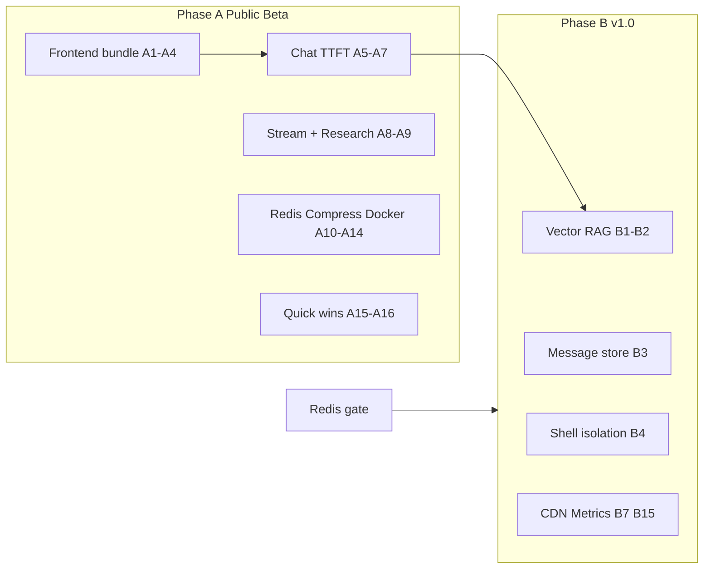

# VANI AI — Performance Implementation Plan

**Date:** 2026-08-06  
**Source:** [PERFORMANCE_AUDIT.md](./PERFORMANCE_AUDIT.md) (RC1-P1)  
**Constraint:** Planning only — **no code changes** in this document’s delivery  
**Goal:** Sequence every audit finding into shippable phases for Public Beta → v1.0 → post-launch

---

## Phase definitions

| Phase | Gate | Intent |
|-------|------|--------|
| **A — Public Beta** | Must fix before Public Beta marketing / open signup | User-visible latency, first-load regression, correctness under multi-replica, prevent re-regression |
| **B — v1.0** | Should fix before v1.0 GA | Scale, long-chat durability, architecture isolation, warm pools, delivery hardening |
| **C — Post-launch** | Can wait until after launch | Polish, secondary surfaces, opportunistic gains |

### Effort scale

| Size | Rough engineering time |
|------|------------------------|
| **XS** | &lt; 2 hours |
| **S** | 0.5–1 day |
| **M** | 2–4 days |
| **L** | 1–2 weeks |
| **XL** | Multi-sprint / schema migration |

### Impact scale (estimated)

| Level | Meaning |
|-------|---------|
| **High** | Most users feel it every session (TTI, TTFT, stream jank, rate-limit correctness) |
| **Medium** | Feature-path or scale path (OCR, research, project RAG, deploys) |
| **Low** | Edge cases, ops convenience, secondary UI |

---

## Executive summary

| Phase | Finding count | Combined effort (order of magnitude) | Exit criteria |
|-------|--------------:|--------------------------------------|---------------|
| **A** | 22 work items | ~3–4 engineer-weeks | `/` first-load ≤ **1.8 MB**; chat TTFT materially down; Redis required if replicas &gt; 1; compression on; CI bundle budget green |
| **B** | 18 work items | ~4–6 engineer-weeks | Vector search for RAG; message storage strategy; ChatPage isolation; CDN; metrics; warm pools |
| **C** | 12 work items | ~1–2 engineer-weeks | Polish + secondary optimizations |
| **Maintain** | 7 items | — | Keep as-is (already healthy) |

**Suggested order inside Phase A:** Frontend bundle quick wins → chat TTFT parallelization → OCR dedupe/pool → stream batching → research parallel search → Redis/compression/Docker/CI gates.

**Do not start Phase A implementation until RC1-S1 Security Audit is complete** (or explicitly scheduled in parallel by product) — avoids conflicting auth/middleware edits.

---

## Phase A — Must fix before Public Beta

### A1. Dynamic-import ExportMenu / jspdf

| | |
|--|--|
| **Finding** | FE-C3 (also FE-C1) |
| **Why it matters** | PDF export libs ship on every authenticated session via always-mounted Sidebar. |
| **Estimated impact** | **High** — large first-load JS reduction for all users |
| **Estimated effort** | **S** |
| **Dependencies** | None |
| **Risk** | **Low** — export click path must still resolve; test PDF/MD/TXT exports |

### A2. Split `@/lib/canvas` barrel (no export in `useCanvas` graph)

| | |
|--|--|
| **Finding** | FE-C2 (also FE-C1) |
| **Why it matters** | Canvas API hook pulls jspdf/docx into `/` even when Canvas never opens. |
| **Estimated impact** | **High** — hundreds of KB off first load |
| **Estimated effort** | **S–M** |
| **Dependencies** | Coordinate import sites (`useCanvas`, `CanvasPanel`, export callers) |
| **Risk** | **Low–Medium** — barrel split can break deep imports; add unit/build check |

### A3. Lazy-load KaTeX / math markdown path

| | |
|--|--|
| **Finding** | FE-M1, FE-m3 (also FE-C1) |
| **Why it matters** | Math/syntax stack + KaTeX fonts inflate first paint for empty/non-math chats. |
| **Estimated impact** | **High** — first-load + FOIT |
| **Estimated effort** | **M** |
| **Dependencies** | A1–A2 preferred first (measure residual after jspdf removal) |
| **Risk** | **Medium** — false-negative `$` detection; streaming math flicker; CSS load timing |

### A4. Restore first-load budget + refresh PERFORMANCE_REPORT + CI gate

| | |
|--|--|
| **Finding** | FE-C1, FE-m8, FE-m9, INF-M4 (bundle budget slice), INF-M8 |
| **Why it matters** | Without a hard budget, regressions re-enter; docs currently claim 1.77 MB falsely. |
| **Estimated impact** | **High** (process) — protects all bundle wins |
| **Estimated effort** | **S** (docs + CI step); INF-M4 Next cache can trail |
| **Dependencies** | A1–A3 for realistic budget (~≤ 1.8 MB) |
| **Risk** | **Low** — flaky CI if Turbopack stats path changes; pin measurement script |

### A5. Parallelize chat pre-stream work; drop redundant User fetch; cache FeatureGate

| | |
|--|--|
| **Finding** | BE-C1, BE-M4, BE-M5 |
| **Why it matters** | Every chat turn waits on serial Mongo/entitlement work before the model. |
| **Estimated impact** | **High** — TTFT on the primary product path |
| **Estimated effort** | **M** |
| **Dependencies** | Prefer after RC1-S1 (auth/JWT claim changes overlap BE-M5) |
| **Risk** | **Medium** — race conditions if memory/RAG/user fields assumed ordered; entitlement cache staleness |

### A6. Persist OCR at upload; never re-OCR with sidecar; dedupe force-OCR

| | |
|--|--|
| **Finding** | BE-M1, BE-M2, BE-m7 (also BE-C1) |
| **Why it matters** | File chats re-pay OCR before first token; force-OCR can double work. |
| **Estimated impact** | **High** for upload/OCR users; **Medium** overall |
| **Estimated effort** | **M** |
| **Dependencies** | Upload sidecar schema already exists; coordinate with A7 |
| **Risk** | **Medium** — stale/corrupt sidecar text; intent routers must still force-edit correctly |

### A7. OCR worker pool + capped parallel page OCR

| | |
|--|--|
| **Finding** | BE-C3 |
| **Why it matters** | Global lock serializes all OCR; multi-page PDFs and concurrent users queue. |
| **Estimated impact** | **High** under concurrent docs; **Medium** single-user |
| **Estimated effort** | **M** |
| **Dependencies** | A6 reduces work volume; memory budget for N workers |
| **Risk** | **Medium** — memory spikes; worker crash handling; Docker RAM limits |

### A8. Batch SSE token updates (rAF / 16–32 ms)

| | |
|--|--|
| **Finding** | FE-M2 |
| **Why it matters** | Per-token `setMessages` janks the main thread during the core streaming UX. |
| **Estimated impact** | **High** during generation |
| **Estimated effort** | **M** |
| **Dependencies** | None (frontend-only); keep Stop/Abort semantics |
| **Risk** | **Medium** — delayed UI vs stop; research/agent delta paths must share batching |

### A9. Parallelize Deep Research `searchMany` (bound 2–3)

| | |
|--|--|
| **Finding** | BE-M3 |
| **Why it matters** | Searching phase is N× sequential provider latency for a flagship Pro feature. |
| **Estimated impact** | **Medium–High** for research users |
| **Estimated effort** | **S** |
| **Dependencies** | Respect provider rate limits / AbortSignal |
| **Risk** | **Low–Medium** — provider throttling; event ordering in SSE progress UI |

### A10. Require Redis for multi-replica; document single-instance fallback

| | |
|--|--|
| **Finding** | INF-C2, BE-m6 |
| **Why it matters** | Without Redis, rate limits multiply by replica count — security *and* fairness failure. |
| **Estimated impact** | **High** if scaling; **Low** single-instance |
| **Estimated effort** | **S** (policy + fail-fast validateEnv / launch checklist) |
| **Dependencies** | Ops Redis provisioning; overlaps security posture |
| **Risk** | **Low** for docs/gate; **High** if ignored in production |

### A11. Add Express or edge HTTP compression (exclude SSE/WS)

| | |
|--|--|
| **Finding** | INF-M1 |
| **Why it matters** | Uncompressed JSON APIs burn bandwidth on mobile/WAN. |
| **Estimated impact** | **Medium** |
| **Estimated effort** | **S** |
| **Dependencies** | Prefer edge/LB if CDN in A (INF-M2 is Phase B); app-level is enough for beta |
| **Risk** | **Medium** — must not compress `text/event-stream` or break streaming |

### A12. Slim Docker defaults + frontend `dumb-init` / healthcheck

| | |
|--|--|
| **Finding** | INF-C1, INF-M5 |
| **Why it matters** | Default full image slows deploys/cold starts; frontend PID 1 hurts rolling deploys. |
| **Estimated impact** | **Medium** (ops / cold start) |
| **Estimated effort** | **S** |
| **Dependencies** | Compose/build-arg documentation for full feature image |
| **Risk** | **Low–Medium** — accidental slim image without browser/CI when features enabled |

### A13. Gate browser approval poll (panel-open / visibility)

| | |
|--|--|
| **Finding** | FE-M4 |
| **Why it matters** | Every logged-in session polls forever (≥8s) even when Browser unused. |
| **Estimated impact** | **Medium** (idle network/battery) |
| **Estimated effort** | **S** |
| **Dependencies** | Pending-approval UX must still surface when needed |
| **Risk** | **Low–Medium** — delayed approval dialog if user never opens panel |

### A14. Align probes on `/ready` + launch checklist performance section

| | |
|--|--|
| **Finding** | INF-M3, INF-m3, INF-M8 |
| **Why it matters** | Probe mismatch causes flapping; checklist can ship ops-green but perf-blind. |
| **Estimated impact** | **Medium** (ops reliability) |
| **Estimated effort** | **S** |
| **Dependencies** | A4/A10 gates should appear in checklist |
| **Risk** | **Low** |

### A15. Chat list `.lean()` + `$text` search when `q` set

| | |
|--|--|
| **Finding** | BE-M12 |
| **Why it matters** | Sidebar history is hot path; regex bypasses existing text index. |
| **Estimated impact** | **Medium** at scale; **Low** early beta |
| **Estimated effort** | **S** |
| **Dependencies** | None |
| **Risk** | **Low** — `$text` scoring/UX differs from regex substring |

### A16. Avoid deep-clone of multimodal contents in multiProviderAgent

| | |
|--|--|
| **Finding** | BE-M13 |
| **Why it matters** | Base64 image clone spikes CPU/memory before first token on non-Gemini routes. |
| **Estimated impact** | **Medium** for multi-provider + images |
| **Estimated effort** | **S** |
| **Dependencies** | None |
| **Risk** | **Medium** — accidental mutation of shared content arrays in tool loop |

### Phase A rollup (IDs)

| Work item | Findings covered |
|-----------|------------------|
| A1–A4 | FE-C1, FE-C2, FE-C3, FE-M1, FE-m3, FE-m8, FE-m9, INF-M4†, INF-M8† |
| A5–A7 | BE-C1, BE-C3, BE-M1, BE-M2, BE-M4, BE-M5, BE-m7 |
| A8–A9 | FE-M2, BE-M3 |
| A10–A14 | INF-C1, INF-C2, INF-M1, INF-M3, INF-M5, INF-M8, INF-m3, BE-m6, FE-M4 |
| A15–A16 | BE-M12, BE-M13 |

† Bundle-budget / checklist slices of INF-M4 and INF-M8; remaining CI cache / CDN work → Phase B.

**Phase A exit checklist**

- [ ] `/` first-load uncompressed JS ≤ **1.8 MB** (CI enforced)  
- [ ] Measured chat TTFT improvement on staging (no-file and with-file paths)  
- [ ] OCR not re-run when sidecar text present; pool handles concurrent pages  
- [ ] Streaming UI remains smooth under long replies (manual + optional INP check)  
- [ ] `REDIS_URL` required when replica count &gt; 1 (documented + validated)  
- [ ] Compression active; SSE still streams  
- [ ] Slim vs full image documented; frontend healthcheck green  

---

## Phase B — Should fix before v1.0

### B1. Atlas Vector Search (or ANN) for RAG (+ align PDF search)

| | |
|--|--|
| **Finding** | BE-C2 |
| **Why it matters** | In-app cosine over 400 embeddings will not scale with project KBs; blocks TTFT on project chats. |
| **Estimated impact** | **High** at KB scale |
| **Estimated effort** | **L** |
| **Dependencies** | Atlas (or alternative) vector index ops; embedding model versioning |
| **Risk** | **High** — infra cost, index rebuild, relevance regression |

### B2. Interim RAG mitigations (candidate limit, query-embed cache)

| | |
|--|--|
| **Finding** | BE-C2 (partial) |
| **Why it matters** | Bridge until vector search ships; still helps beta if B1 slips. |
| **Estimated impact** | **Medium** |
| **Estimated effort** | **S** |
| **Dependencies** | Can start late Phase A if project-heavy beta; owned as B for sequencing |
| **Risk** | **Low** — lower recall if limit too aggressive |

### B3. Message storage strategy (collection / `$push` / pagination)

| | |
|--|--|
| **Finding** | BE-C4 |
| **Why it matters** | Embedded `messages[]` hits BSON limits and rewrite cost on long chats. |
| **Estimated impact** | **High** for power users; **Medium** early |
| **Estimated effort** | **L–XL** |
| **Dependencies** | Chat vs ChatV2 strategy (roadmap M3); migration plan |
| **Risk** | **High** — data migration, continue/regenerate semantics, share/export |

### B4. Isolate research / agent / browser like Voice; gate hook `enabled`

| | |
|--|--|
| **Finding** | FE-M3 (also FE-M7 guidance) |
| **Why it matters** | Monolithic `ChatPage` re-renders and keeps idle hooks alive. |
| **Estimated impact** | **Medium–High** runtime |
| **Estimated effort** | **L** |
| **Dependencies** | A8 reduces urgency; panel APIs must stay stable |
| **Risk** | **High** — large page.tsx refactor; regression risk across features |

### B5. Memory retrieve parallelize + `.lean()` + Redis cache

| | |
|--|--|
| **Finding** | BE-M6, BE-M7 (memory slice) |
| **Why it matters** | Memory sits on chat hot path (capped ~1.2s) and is process-local today. |
| **Estimated impact** | **Medium** |
| **Estimated effort** | **M** |
| **Dependencies** | A10 Redis requirement for multi-node value |
| **Risk** | **Medium** — cache invalidation / privacy of cached snippets |

### B6. Redis for entitlements / OCR hashes / research cache (shared)

| | |
|--|--|
| **Finding** | BE-M7 (broader) |
| **Why it matters** | Multi-instance correctness and hit-rate beyond rate limits. |
| **Estimated impact** | **Medium–High** multi-replica |
| **Estimated effort** | **M** |
| **Dependencies** | A10 |
| **Risk** | **Medium** — TTL/staleness; Redis memory |

### B7. CDN / `assetPrefix` / immutable `/_next/static` cache headers

| | |
|--|--|
| **Finding** | INF-M2 |
| **Why it matters** | Even a 1.8 MB budget still needs edge delivery for global beta → GA. |
| **Estimated impact** | **High** for remote users |
| **Estimated effort** | **M** |
| **Dependencies** | CDN vendor; A4 budget still required |
| **Risk** | **Medium** — cache busting / wrong assetPrefix |

### B8. CI Next/Docker layer caches; make critical perf budgets blocking

| | |
|--|--|
| **Finding** | INF-M4 (remaining) |
| **Why it matters** | Faster feedback and hard stop on perf regressions. |
| **Estimated impact** | **Medium** (eng velocity + quality) |
| **Estimated effort** | **M** |
| **Dependencies** | A4 budget script |
| **Risk** | **Low–Medium** — cache invalidation complexity |

### B9. Agent fast-path / stream plan status / skip verify when safe

| | |
|--|--|
| **Finding** | BE-M8 |
| **Why it matters** | Agent TTFB is multi-LLM before any answer stream. |
| **Estimated impact** | **Medium** for agent users |
| **Estimated effort** | **M** |
| **Dependencies** | Product rules for when verify is required |
| **Risk** | **Medium** — quality regressions on complex tasks |

### B10. Warm Chromium at boot (optional) + keep session caps

| | |
|--|--|
| **Finding** | BE-M9 |
| **Why it matters** | First browser automation remains multi-second cold. |
| **Estimated impact** | **Medium** for browser users |
| **Estimated effort** | **S–M** |
| **Dependencies** | Full Docker image (INF-C1 slim vs full) |
| **Risk** | **Medium** — idle memory cost on every replica |

### B11. Code Interpreter warm kernel pool

| | |
|--|--|
| **Finding** | BE-M10 |
| **Why it matters** | First execute pays Python spawn every session. |
| **Estimated impact** | **Medium** for CI users |
| **Estimated effort** | **M** |
| **Dependencies** | Full image with Python stack; security sandbox limits |
| **Risk** | **Medium–High** — idle kernels, isolation, resource leaks |

### B12. Analytics DailyUsage batch / Redis aggregate

| | |
|--|--|
| **Finding** | BE-M11 |
| **Why it matters** | Per-request upsert write amplification under load. |
| **Estimated impact** | **Medium** at scale |
| **Estimated effort** | **S–M** |
| **Dependencies** | Redis helpful but not mandatory for in-process batch flush |
| **Risk** | **Low–Medium** — lost increments on crash if buffered |

### B13. SSE drain protocol on graceful shutdown

| | |
|--|--|
| **Finding** | INF-M6 |
| **Why it matters** | Rolling deploys cut streams → reconnect storms. |
| **Estimated impact** | **Medium** under continuous deploys |
| **Estimated effort** | **M** |
| **Dependencies** | Client reconnect behavior; LB drain |
| **Risk** | **Medium** — incomplete drain still force-kills |

### B14. Scope `express.json` 30mb to upload/chat routes

| | |
|--|--|
| **Finding** | INF-M7, BE-m1 |
| **Why it matters** | Global large body limit increases heap risk under abuse/concurrency. |
| **Estimated impact** | **Medium** (reliability) |
| **Estimated effort** | **S–M** |
| **Dependencies** | Audit all large-body routes |
| **Risk** | **Medium** — silent 413 on a forgotten route |

### B15. Wire metrics sink (Prometheus/Datadog) + replica runbook

| | |
|--|--|
| **Finding** | INF-M9 |
| **Why it matters** | Cannot run v1.0 SLOs without external latency histograms. |
| **Estimated impact** | **High** (ops) / **Low** (user-direct) |
| **Estimated effort** | **M** |
| **Dependencies** | Vendor choice; A10 for multi-replica |
| **Risk** | **Low–Medium** — cardinality / cost |

### B16. Improve virtualization (lower threshold or `@tanstack/react-virtual`)

| | |
|--|--|
| **Finding** | FE-M5 |
| **Why it matters** | Long threads and tall markdown rows still jank/scroll-jump. |
| **Estimated impact** | **Medium** |
| **Estimated effort** | **M** |
| **Dependencies** | A8 first (reduces stream pressure) |
| **Risk** | **Medium** — scroll anchoring / focus / regenerate UI |

### B17. Trim Framer Motion on shell; CSS for typing/chrome

| | |
|--|--|
| **Finding** | FE-M6 |
| **Why it matters** | Motion runtime on critical chrome after bundle already strained. |
| **Estimated impact** | **Medium** |
| **Estimated effort** | **M** |
| **Dependencies** | UI polish board — avoid visual regressions |
| **Risk** | **Medium** — perceived “cheapness” if motion removed poorly |

### B18. Dynamic-import lightboxes / workspace tabs; agent/research unmount abort

| | |
|--|--|
| **Finding** | FE-m6, FE-m4 |
| **Why it matters** | Extra always-parsed UI; stale setState on remount/HMR. |
| **Estimated impact** | **Low–Medium** |
| **Estimated effort** | **S–M** |
| **Dependencies** | Complements B4 |
| **Risk** | **Low** |

### Phase B exit checklist

- [ ] Project RAG uses vector/ANN search (or documented interim limits with measured p95)  
- [ ] Long-chat storage plan implemented or hard product cap enforced  
- [ ] Idle feature hooks no longer always-on at ChatPage level  
- [ ] CDN serves hashed static assets with long cache  
- [ ] External metrics show chat TTFT / error rate  
- [ ] Agent / browser / CI cold-start SLAs documented and met in staging  

---

## Phase C — Can wait until after launch

### C1. Mermaid CDN / lighter diagram path

| | |
|--|--|
| **Finding** | FE-m7 |
| **Why it matters** | Cold diagram open is slow but deferred and infrequent. |
| **Estimated impact** | **Low–Medium** |
| **Estimated effort** | **M** |
| **Dependencies** | Artifact preview already dynamic |
| **Risk** | **Low–Medium** — CDN/version skew |

### C2. Browser screenshot `loading="lazy"` / `decoding="async"`

| | |
|--|--|
| **Finding** | FE-m2 |
| **Why it matters** | Minor decode/bandwidth on Browser panel. |
| **Estimated impact** | **Low** |
| **Estimated effort** | **S** |
| **Dependencies** | None |
| **Risk** | **Low** |

### C3. `next/image` for marketing/static assets (if any)

| | |
|--|--|
| **Finding** | INF-m2 |
| **Why it matters** | Missed format/size optimization on static product pages. |
| **Estimated impact** | **Low** (chat blobs are API-served) |
| **Estimated effort** | **S** |
| **Dependencies** | Actual marketing surfaces |
| **Risk** | **Low** |

### C4. Pin Next `compress: true`; prefer edge Brotli

| | |
|--|--|
| **Finding** | INF-m1 |
| **Why it matters** | Explicit default; edge already preferred via B7. |
| **Estimated impact** | **Low** |
| **Estimated effort** | **XS** |
| **Dependencies** | B7 CDN |
| **Risk** | **Low** |

### C5. Remove Mongo/Redis host port publishes in prod-shaped compose

| | |
|--|--|
| **Finding** | INF-m4 |
| **Why it matters** | Attack surface / accidental remote load (security-adjacent). |
| **Estimated impact** | **Low** (perf); **Medium** (security) |
| **Estimated effort** | **XS** |
| **Dependencies** | Prod compose overlay |
| **Risk** | **Low** |

### C6. Defer browser path `existsSync` until first automation

| | |
|--|--|
| **Finding** | INF-m5 |
| **Why it matters** | Tiny boot IO; only matters under tight boot budgets. |
| **Estimated impact** | **Low** |
| **Estimated effort** | **XS** |
| **Dependencies** | None |
| **Risk** | **Low** |

### C7. Cache Playwright browsers in GHA for e2e

| | |
|--|--|
| **Finding** | INF-m6 |
| **Why it matters** | CI time only. |
| **Estimated impact** | **Low** (eng) |
| **Estimated effort** | **S** |
| **Dependencies** | B8 CI work |
| **Risk** | **Low** |

### C8. Parallel MCP health checks

| | |
|--|--|
| **Finding** | BE-m2 |
| **Why it matters** | Sequential health across many servers adds Settings latency. |
| **Estimated impact** | **Low** |
| **Estimated effort** | **S** |
| **Dependencies** | None |
| **Risk** | **Low** |

### C9. Gated live TTFT smoke in staging (p50/p95)

| | |
|--|--|
| **Finding** | BE-m5 |
| **Why it matters** | Current perf tests mock Gemini — blind to real latency. |
| **Estimated impact** | **Medium** (process) / **Low** (user-direct) |
| **Estimated effort** | **M** |
| **Dependencies** | Staging keys; cost controls |
| **Risk** | **Medium** — flaky / expensive CI |

### C10. Client-shell RSC architecture rethink

| | |
|--|--|
| **Finding** | FE-M7 |
| **Why it matters** | Chat forces client shell; full RSC rewrite is not a beta/v1.0 necessity if graph shrinks via A/B. |
| **Estimated impact** | **Low–Medium** long-term |
| **Estimated effort** | **L–XL** |
| **Dependencies** | B4 isolation first |
| **Risk** | **High** — architectural rewrite |

### C11. Memory / PDF vector index alignment (beyond RAG)

| | |
|--|--|
| **Finding** | BE-C2 related (Memory / PDF intel same pattern) |
| **Why it matters** | Same ANN gap as RAG; less critical if candidate sets stay small. |
| **Estimated impact** | **Medium** at scale |
| **Estimated effort** | **L** |
| **Dependencies** | B1 patterns/tooling |
| **Risk** | **High** (same as B1) |

### C12. Extend FeaturePanels pattern (documented maintain + FE-m1)

| | |
|--|--|
| **Finding** | FE-m1 |
| **Why it matters** | Positive pattern — keep extending rather than one-shot rewrite. |
| **Estimated impact** | **Low** incremental |
| **Estimated effort** | Ongoing / **S** per panel |
| **Dependencies** | A1–A3, B18 |
| **Risk** | **Low** |

---

## Maintain — no change required

These audit items are healthy or “keep” guidance. Track only; do not schedule work.

| ID | Note |
|----|------|
| FE-m5 | Interval cleanup patterns healthy (aside from FE-m4 aborts in B18) |
| BE-m3 | Research fetch concurrency already good |
| BE-m4 | Document/PDF disk caches help repeats |
| BE-m8 | Identity guard cost acceptable |
| INF-m7 | NODE_ENV + validateEnv + backend graceful shutdown — keep; frontend parity is A12 |
| FE-m1 (core) | FeaturePanels registry itself — maintain |
| — | Browser shared pool, MCP reconnect, chat list projections, multi-stage Docker — keep |

---

## Master classification matrix

| ID | Phase | Effort | Impact |
|----|-------|--------|--------|
| FE-C1 | **A** (via A1–A4) | M–L | High |
| FE-C2 | **A** | S–M | High |
| FE-C3 | **A** | S | High |
| FE-M1 | **A** | M | High |
| FE-M2 | **A** | M | High |
| FE-M3 | **B** | L | Medium–High |
| FE-M4 | **A** | S | Medium |
| FE-M5 | **B** | M | Medium |
| FE-M6 | **B** | M | Medium |
| FE-M7 | **C** | L–XL | Low–Medium |
| FE-m1 | Maintain / **C12** | — | — |
| FE-m2 | **C** | S | Low |
| FE-m3 | **A** (with FE-M1) | S–M | Medium |
| FE-m4 | **B** | S | Low |
| FE-m5 | Maintain | — | — |
| FE-m6 | **B** | S–M | Low–Medium |
| FE-m7 | **C** | M | Low–Medium |
| FE-m8 | **A** | S | Medium (process) |
| FE-m9 | **A** | S | High (process) |
| BE-C1 | **A** | M | High |
| BE-C2 | **B** (+ interim B2; Memory/PDF **C11**) | L | High |
| BE-C3 | **A** | M | High |
| BE-C4 | **B** | L–XL | High |
| BE-M1 | **A** | M | High |
| BE-M2 | **A** | S–M | Medium–High |
| BE-M3 | **A** | S | Medium–High |
| BE-M4 | **A** | S | Medium |
| BE-M5 | **A** | S | Medium |
| BE-M6 | **B** | M | Medium |
| BE-M7 | **B** | M | Medium–High |
| BE-M8 | **B** | M | Medium |
| BE-M9 | **B** | S–M | Medium |
| BE-M10 | **B** | M | Medium |
| BE-M11 | **B** | S–M | Medium |
| BE-M12 | **A** | S | Medium |
| BE-M13 | **A** | S | Medium |
| BE-m1 | **B** (with INF-M7) | S–M | Medium |
| BE-m2 | **C** | S | Low |
| BE-m3 | Maintain | — | — |
| BE-m4 | Maintain | — | — |
| BE-m5 | **C** | M | Medium (process) |
| BE-m6 | **A** (ops with INF-C2) | S | High if multi-replica |
| BE-m7 | **A** (with BE-M1) | S | Medium |
| BE-m8 | Maintain | — | — |
| INF-C1 | **A** | S–M | Medium |
| INF-C2 | **A** | S | High if multi-replica |
| INF-M1 | **A** | S | Medium |
| INF-M2 | **B** | M | High |
| INF-M3 | **A** | S | Medium |
| INF-M4 | **A** budget + **B** caches | S / M | Medium |
| INF-M5 | **A** | S | Medium |
| INF-M6 | **B** | M | Medium |
| INF-M7 | **B** | S–M | Medium |
| INF-M8 | **A** | S | Medium (process) |
| INF-M9 | **B** | M | High (ops) |
| INF-m1 | **C** | XS | Low |
| INF-m2 | **C** | S | Low |
| INF-m3 | **A** (with INF-M3) | XS | Low–Medium |
| INF-m4 | **C** | XS | Low |
| INF-m5 | **C** | XS | Low |
| INF-m6 | **C** | S | Low |
| INF-m7 | Maintain (+ A12 frontend parity) | — | — |

---

## Suggested workstreams (parallelizable)

| Stream | Phase A items | Can parallelize with |
|--------|---------------|----------------------|
| Frontend delivery | A1, A2, A3, A4, A8, A13 | Backend TTFT stream |
| Backend TTFT / OCR | A5, A6, A7, A15, A16 | Frontend stream |
| Research | A9 | Either |
| Ops / infra | A10, A11, A12, A14 | Either |
| Security (RC1-S1) | — | Prefer complete before A5 JWT/auth edits |

---

## Success metrics (proposed)

| Metric | Public Beta (Phase A) | v1.0 (Phase B) |
|--------|----------------------|----------------|
| `/` first-load JS (uncompressed) | ≤ **1.8 MB** | ≤ **1.5 MB** aspirational |
| Chat TTFT p50 (no files, staging) | Baseline − **≥ 30%** | − **≥ 50%** vs audit baseline |
| Chat TTFT p95 (with image upload) | No double OCR; sidecar hit | Stable under concurrency |
| Research search phase | Parallel 2–3 queries | Unchanged or better |
| Multi-replica rate limit | Correct with Redis | Shared caches for memory/OCR |
| Perf CI | Bundle budget blocking | + staging TTFT smoke (C9 optional) |

Baselines to capture before Phase A coding starts: current `/` bytes, staging TTFT p50/p95 (no-file / with-file), research search duration for N=4 queries.

---

## Out of scope for this plan

- Implementing any fix (code changes)  
- Security remediation (RC1-S1)  
- UI redesign / Business-Enterprise features  
- Changing product feature set  

---

## Document control

| | |
|--|--|
| **Audit** | [PERFORMANCE_AUDIT.md](./PERFORMANCE_AUDIT.md) |
| **Prior frontend sprint** | [PERFORMANCE_REPORT.md](../../PERFORMANCE_REPORT.md) |
| **Execution board** | [SPRINT_BOARD.md](../management/SPRINT_BOARD.md) — schedule Phase A as a sprint slice after RC1-S1 |
| **Status** | Plan only — **0 fixes applied** |

---

*End of Performance Implementation Plan.*
